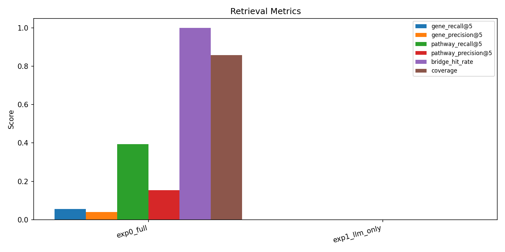
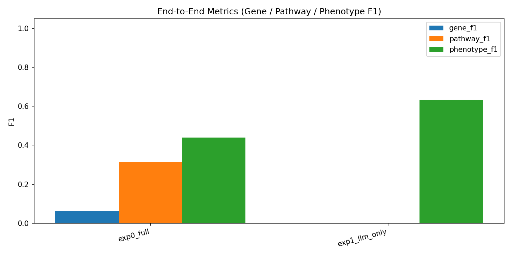

# GDgpt 毕业设计进展汇报

> **项目名称**：基于 Task KG 的多智能体基因-疾病-通路机制分析系统  
> **汇报日期**：2026年3月19日  
> **学生**：[姓名]  
> **指导教师**：[导师姓名]

---

## 目录

1. [项目概述](#1-项目概述)
2. [系统设计与架构](#2-系统设计与架构)
3. [核心技术实现](#3-核心技术实现)
4. [实验设计与结果](#4-实验设计与结果)
5. [当前遇到的难点](#5-当前遇到的难点)
6. [下一步计划](#6-下一步计划)
7. [时间安排](#7-时间安排)

---

## 1. 项目概述

### 1.1 研究背景与应用场景

#### 1.1.1 应用场景

本系统面向**临床辅助诊断和生物医学研究**，核心应用场景如下：

```
┌─────────────────────────────────────────────────────────────────────────────┐
│                           典型用户交互场景                                    │
├─────────────────────────────────────────────────────────────────────────────┤
│                                                                             │
│  场景一：用户输入【疾病名称】                                                │
│  ┌───────────────────────────────────────────────────────────────────────┐  │
│  │ 用户: "我怀疑我有 breast carcinoma，帮我分析一下"                      │  │
│  │                                                                       │  │
│  │ 系统输出:                                                             │  │
│  │   ├─ 相关基因: BRCA1, BRCA2, TP53, PIK3CA, ERBB2...                  │  │
│  │   ├─ 涉及通路: PI3K/AKT/mTOR, MAPK, DNA Repair Pathway...            │  │
│  │   ├─ 典型症状: 乳房肿块、皮肤改变、淋巴结肿大...                       │  │
│  │   └─ 治疗药物: Tamoxifen, Trastuzumab (靶向 ERBB2)...                │  │
│  └───────────────────────────────────────────────────────────────────────┘  │
│                                                                             │
│  场景二：用户输入【基因名称】                                                │
│  ┌───────────────────────────────────────────────────────────────────────┐  │
│  │ 用户: "TP53 基因突变会导致什么疾病和症状？"                             │  │
│  │                                                                       │  │
│  │ 系统输出:                                                             │  │
│  │   ├─ 关联疾病: Li-Fraumeni syndrome, 多种癌症...                      │  │
│  │   ├─ 参与通路: Cell Cycle, Apoptosis, DNA Damage Response...         │  │
│  │   └─ 表型症状: 通过 TP53→Disease→Phenotype 多跳推理得出              │  │
│  └───────────────────────────────────────────────────────────────────────┘  │
│                                                                             │
│  场景三：用户输入【药物名称】                                                │
│  ┌───────────────────────────────────────────────────────────────────────┐  │
│  │ 用户: "Tamoxifen 的作用机制是什么？能治疗哪些疾病？"                    │  │
│  │                                                                       │  │
│  │ 系统输出:                                                             │  │
│  │   ├─ 靶向基因: ESR1, ESR2 (雌激素受体)                               │  │
│  │   ├─ 可治疗疾病: Breast carcinoma (ER+)                              │  │
│  │   └─ 机制链: Drug→Gene→Disease 完整证据链                            │  │
│  └───────────────────────────────────────────────────────────────────────┘  │
│                                                                             │
└─────────────────────────────────────────────────────────────────────────────┘
```

#### 1.1.2 核心价值

| 价值维度 | 传统方式（手动查询 / 纯 LLM） | 本系统（Task KG + 多智能体） |
|----------|------------------------------|------------------------------|
| **信息来源** | LLM 内部知识，可能过时或幻觉 | 结构化 KG，可追溯、可验证 |
| **推理深度** | 单步联想 | 多跳推理（Disease→Gene→Pathway） |
| **证据可信度** | 无法区分事实与推测 | 明确标注图谱支持的事实 |
| **覆盖全面性** | 依赖 LLM 记忆的知识 | 系统性检索 5 类实体、11 种关系 |

#### 1.1.3 核心问题与挑战

用户提问往往涉及**复杂的多实体关联**，如：

> "我怀疑我有 breast carcinoma，把相关的基因/通路给我解释一下，以及有什么症状？"

要完整回答这个问题，需要：

| 子任务 | 所需查询路径 | 难点 |
|--------|--------------|------|
| 找相关基因 | Disease → Gene | 需精准实体匹配 |
| 找涉及通路 | Disease → Gene → Pathway | **需多跳推理** |
| 找症状表型 | Disease → Phenotype | 需区分临床症状与分子表型 |
| 综合分析 | 多路径整合 | 需多角色协同 |

**核心挑战：**

| 挑战 | 说明 |
|------|------|
| **多跳推理** | 需要 Disease→Gene→Pathway 等多步查询，单次查询难以覆盖 |
| **事实与推测混淆** | 需区分「图谱支持的事实」与「LLM 推测性结论」 |
| **领域知识整合** | 需要多个专业视角（基因、通路、药物等）协同分析 |

### 1.2 研究目标

构建一个**基于 Task KG 的多智能体 GDP（Gene-Disease-Pathway）机制分析系统**，通过结合：
- **大语言模型（LLM）**：负责推理、综合、规划
- **结构化知识图谱（Neo4j Task KG）**：提供可验证的事实支撑
- **多角色专家协同**：从多个专业视角分析问题

实现对复杂生物医学机制问题的**准确、可解释、可追溯**的回答。

**核心能力目标：**

```
输入: 疾病名称 / 基因名称 / 药物名称 / 自然语言问题
          ↓
      GDgpt 系统
          ↓
输出: 
  ✓ 关联基因（带来源、权重）
  ✓ 涉及通路（通过多跳推理得出）
  ✓ 临床症状/表型
  ✓ 治疗药物及靶点
  ✓ 完整的机制链解释（可追溯到图谱证据）
```

### 1.3 核心创新点

| 创新点 | 描述 | 技术实现 |
|--------|------|----------|
| **Task KG 集成** | 基于 Neo4j 的结构化知识图谱，包含 5 类实体 | Bolt 协议连接，Cypher 查询 |
| **Bridge 多跳查询** | 设计 3 种多跳查询意图，支持复杂机制链推理 | 预定义 Cypher 模板 + LLM 规划 |
| **KG Prefetch 机制** | 在专家会诊前预取共享 KG 证据 | LangGraph 工作流节点 |
| **多角色专家协同** | 7 种专业角色分工协作 | 独立推理 + 综合机制 |
| **双知识库** | CorrectKB + ChainKB 作为长期经验记忆 | FAISS 向量检索 |

---

## 2. 系统设计与架构

### 2.1 整体架构图

```
┌─────────────────────────────────────────────────────────────────────────┐
│                              用户界面 (Streamlit)                        │
│                         问题输入 / 配置 / 结果展示                         │
└─────────────────────────────────────────────────────────────────────────┘
                                      │
                                      ▼
┌─────────────────────────────────────────────────────────────────────────┐
│                         LangGraph 工作流引擎                             │
│  ┌─────────┐   ┌──────────────┐   ┌─────────────┐   ┌──────────────┐   │
│  │ Triage  │ → │ KG Prefetch  │ → │Consultation │ → │Safety Review │   │
│  │  分诊   │   │  KG 预取     │   │  专家会诊   │   │  安全评审    │   │
│  └─────────┘   └──────────────┘   └─────────────┘   └──────────────┘   │
│                                          ↑               │              │
│                                          └───────────────┘              │
│                                         （未收敛则循环）                  │
└─────────────────────────────────────────────────────────────────────────┘
          │                    │                    │
          ▼                    ▼                    ▼
┌─────────────────┐  ┌─────────────────┐  ┌─────────────────────────────┐
│   LLM (GPT-4o)  │  │  Neo4j Task KG  │  │  FAISS 双知识库             │
│   推理/规划/综合 │  │  结构化查询     │  │  CorrectKB / ChainKB        │
└─────────────────┘  └─────────────────┘  └─────────────────────────────┘
```

### 2.2 工作流详细说明

```
用户输入问题
    ↓
┌─────────────────────────────────────────────────────────┐
│ [1] Triage 分诊                                         │
│     - 分析问题类型（疾病/基因/药物相关）                  │
│     - 从 7 个专家角色中选择 ≥3 个                        │
│     - 初始化 FAISS 双知识库，检索历史经验                 │
└─────────────────────────────────────────────────────────┘
    ↓
┌─────────────────────────────────────────────────────────┐
│ [2] KG Prefetch 共享预取                                │
│     - LLM 规划 KG 查询（从 11 种意图中选择 2-3 个）       │
│     - 执行 Neo4j Cypher 查询                            │
│     - 将结果作为共享证据供所有专家使用                    │
└─────────────────────────────────────────────────────────┘
    ↓
┌─────────────────────────────────────────────────────────┐
│ [3] Consultation 专家会诊                               │
│     - 各角色独立分析（互不可见当前轮输出）                │
│     - 每个专家可调用 KG 工具补充查询                     │
│     - Lead Physician 综合各专家意见                     │
└─────────────────────────────────────────────────────────┘
    ↓
┌─────────────────────────────────────────────────────────┐
│ [4] Safety Review 安全评审                              │
│     - 判断是否收敛到可防御的结论                         │
│     - 收敛 → 输出最终答案                               │
│     - 未收敛 → 返回 [3] 继续会诊（最多 max_rounds 轮）   │
└─────────────────────────────────────────────────────────┘
    ↓
最终答案输出
```

### 2.3 专家角色设计

系统设计了 7 种专业角色，覆盖生物医学机制分析的各个方面：

| 角色 | 英文名称 | 职责说明 |
|------|----------|----------|
| **基因管理员** | GeneCurator | 基因规范化、别名映射、基因级证据质量评估 |
| **疾病机制分析师** | DiseaseMechanismAnalyst | 疾病-基因机制解释、因果假设排序 |
| **通路生物学家** | PathwayBiologist | 通路级 Bridge 证据追踪、机制级联分析 |
| **表型映射员** | PhenotypeMapper | 疾病/基因证据到表型、可观测性状的映射 |
| **药物机制分析师** | DrugMechanismAnalyst | 治疗、靶点、禁忌、药物-基因-疾病链接 |
| **证据评审员** | EvidenceReviewer | 区分图谱支持的事实与弱/推测性主张 |
| **假设整合者** | HypothesisIntegrator | 将多跳证据整合为连贯的机制链 |

### 2.4 知识图谱设计

#### 实体类型（5 类）

| 实体类型 | 英文 | 说明 |
|----------|------|------|
| 基因 | Gene | 人类基因，含别名、规范化名称 |
| 疾病 | Disease | 疾病名称，含 ICD 编码映射 |
| 通路 | Pathway | 生物学通路（如 PI3K/AKT/mTOR） |
| 表型 | Phenotype | 疾病相关的临床表型 |
| 药物 | Drug | 治疗药物 |

#### 关系类型

| 关系 | 说明 |
|------|------|
| ASSOCIATED_WITH | 基因-疾病关联 |
| INVOLVED_IN | 基因-通路参与 |
| HAS_PHENOTYPE | 疾病-表型关联 |
| TREATS | 药物-疾病治疗 |
| TARGETS | 药物-基因靶向 |

#### 查询意图（11 种）

**单跳查询（8 种）：**
- GeneToDisease、GeneToPathway、GeneToDrug
- DiseaseToGene、DiseaseToPathway、DiseaseToPhenotype、DiseaseToDrug
- DrugToDisease

**多跳 Bridge 查询（3 种）：**
- **DiseaseGenePathwayBridge**：Disease → Gene → Pathway
- **GenePhenotypeBridge**：Gene → Disease → Phenotype
- **DrugTargetDiseaseBridge**：Drug → Gene → Disease

---

## 3. 核心技术实现

### 3.1 项目文件结构

```
GDgpt/
├── app.py                 # Streamlit 主界面
├── workflow.py            # LangGraph 工作流定义
├── agents.py              # 多角色智能体实现
├── tools.py               # Neo4j KG 查询工具
├── knowledge_base.py      # FAISS 双知识库
├── utils.py               # 工具函数
├── config.json            # 运行配置
├── requirements.txt       # Python 依赖
│
├── evaluation/            # 评测相关
│   ├── evaluation_gold_final.jsonl    # 30题 gold 标准
│   ├── experiment_config.yaml         # 实验配置
│   ├── run_all_experiments.py         # 自动化实验脚本
│   ├── compute_metrics.py             # 指标计算
│   └── results/                       # 实验结果
│
└── knowledge_bases/       # FAISS 向量库存储
```

### 3.2 核心技术原理详解

#### 3.2.1 多跳查询（Bridge Query）技术原理

**为什么需要多跳查询？**

单跳查询只能获取直接关联的实体，但真实的生物医学问题往往需要**链式推理**：

```
传统单跳查询的局限：
┌──────────┐                    ┌──────────┐
│  Disease │ ──ASSOCIATED_WITH──→ │   Gene   │  ✓ 可以查到
└──────────┘                    └──────────┘

                                ┌──────────┐
                                │ Pathway  │  ✗ 单跳无法直接到达
                                └──────────┘

用户问题：「breast carcinoma 涉及哪些通路？」
→ 如果只有单跳，Disease 和 Pathway 之间可能没有直接边
→ 必须通过 Disease → Gene → Pathway 的多跳路径才能回答
```

**多跳查询的实现机制：**

本系统设计了 3 种 Bridge 查询意图，通过预定义的 Cypher 模板实现多跳推理：

```
┌────────────────────────────────────────────────────────────────────────────┐
│                    Bridge 查询设计与实现                                    │
├────────────────────────────────────────────────────────────────────────────┤
│                                                                            │
│  ① DiseaseGenePathwayBridge（疾病-基因-通路桥接）                           │
│  ┌──────────┐      r1: ASSOCIATED_WITH      ┌──────────┐                   │
│  │  Disease │ ─────────────────────────────→ │   Gene   │                   │
│  │ (breast  │                               │ (BRCA1,  │                   │
│  │ carcinoma)                               │  TP53...)│                   │
│  └──────────┘                               └────┬─────┘                   │
│                                                  │                         │
│                                                  │ r2: INVOLVED_IN         │
│                                                  ▼                         │
│                                             ┌──────────┐                   │
│                                             │ Pathway  │                   │
│                                             │ (PI3K/AKT│                   │
│                                             │ /mTOR...)│                   │
│                                             └──────────┘                   │
│                                                                            │
│  应用场景：用户询问「某疾病涉及哪些通路」                                    │
│                                                                            │
├────────────────────────────────────────────────────────────────────────────┤
│                                                                            │
│  ② GenePhenotypeBridge（基因-疾病-表型桥接）                                │
│  ┌──────────┐      r1: ASSOCIATED_WITH      ┌──────────┐                   │
│  │   Gene   │ ─────────────────────────────→ │ Disease  │                   │
│  │  (TP53)  │                               │          │                   │
│  └──────────┘                               └────┬─────┘                   │
│                                                  │                         │
│                                                  │ r2: HAS_PHENOTYPE       │
│                                                  ▼                         │
│                                             ┌──────────┐                   │
│                                             │Phenotype │                   │
│                                             │(症状表型)│                   │
│                                             └──────────┘                   │
│                                                                            │
│  应用场景：用户询问「某基因突变会有什么症状」                                │
│                                                                            │
├────────────────────────────────────────────────────────────────────────────┤
│                                                                            │
│  ③ DrugTargetDiseaseBridge（药物-靶点-疾病桥接）                            │
│  ┌──────────┐      r1: TARGETS              ┌──────────┐                   │
│  │   Drug   │ ─────────────────────────────→ │   Gene   │                   │
│  │(Tamoxifen)                               │  (ESR1)  │                   │
│  └──────────┘                               └────┬─────┘                   │
│                                                  │                         │
│                                                  │ r2: ASSOCIATED_WITH     │
│                                                  ▼                         │
│                                             ┌──────────┐                   │
│                                             │ Disease  │                   │
│                                             │ (breast  │                   │
│                                             │ carcinoma)                   │
│                                             └──────────┘                   │
│                                                                            │
│  应用场景：用户询问「某药物能治疗哪些疾病、机制是什么」                       │
│                                                                            │
└────────────────────────────────────────────────────────────────────────────┘
```

**Cypher 实现（以 DiseaseGenePathwayBridge 为例）：**

```cypher
-- DiseaseGenePathwayBridge: 从疾病出发，找到相关基因，再找到基因参与的通路
MATCH (d:Disease)-[r1:ASSOCIATED_WITH]-(g:Gene)-[r2:INVOLVED_IN]-(p:Pathway)
WHERE toLower(d.name) = $disease_norm
       OR toLower(d.normalized_name) = $disease_norm
       OR ANY(alias IN split(d.aliases, '|') WHERE toLower(alias) = $disease_norm)
WITH d, p,
     collect(DISTINCT g.name)[0..5] AS genes,        -- 聚合中间基因（最多5个）
     count(DISTINCT g) AS gene_count,                 -- 统计经过的基因数量
     collect(DISTINCT type(r1)) AS disease_gene_rels, -- 收集关系类型
     collect(DISTINCT type(r2)) AS gene_pathway_rels,
     max(coalesce(r1.weight, 0.0)) AS dg_weight,     -- 取最大权重作为排序依据
     max(coalesce(r2.weight, 0.0)) AS gp_weight
RETURN d.name AS disease, 
       p.name AS pathway, 
       genes,                -- 返回中间基因列表，保证可追溯
       gene_count,
       disease_gene_rels,
       gene_pathway_rels,
       dg_weight,
       gp_weight
ORDER BY gene_count DESC, gp_weight DESC  -- 优先返回经过基因最多、权重最高的通路
LIMIT $k
```

**多跳查询的技术优势：**

| 特性 | 单跳查询 | 多跳 Bridge 查询 |
|------|----------|------------------|
| 查询深度 | 1 跳 | 2+ 跳 |
| 中间实体 | 不可见 | **完整保留**（如 genes 列表） |
| 证据链 | 单一关系 | **完整路径**（Disease→Gene→Pathway） |
| 权重聚合 | 单一权重 | 多关系权重聚合 |
| 排序策略 | 简单 | 综合（基因数量 × 权重） |

#### 3.2.2 KG Prefetch（知识图谱预取）机制

**设计动机：**

多角色专家协同时，如果每个专家都独立查询 KG，会导致：
1. 重复查询，浪费 API 调用
2. 各专家获取的证据不一致
3. 难以形成统一的证据基础

**解决方案：KG Prefetch 节点**

```
┌─────────────────────────────────────────────────────────────────────────┐
│                         KG Prefetch 工作原理                            │
├─────────────────────────────────────────────────────────────────────────┤
│                                                                         │
│  Step 1: LLM 规划查询意图                                               │
│  ┌───────────────────────────────────────────────────────────────────┐  │
│  │ 输入: "breast carcinoma 的基因/通路/症状"                         │  │
│  │                                                                   │  │
│  │ LLM 输出 JSON Plan:                                               │  │
│  │ {                                                                 │  │
│  │   "queries": [                                                    │  │
│  │     {"tool": "Neo4j_KG", "intent": "DiseaseToGene",               │  │
│  │      "disease": "breast carcinoma", "k": 10},                     │  │
│  │     {"tool": "Neo4j_KG", "intent": "DiseaseGenePathwayBridge",    │  │
│  │      "disease": "breast carcinoma", "k": 10},                     │  │
│  │     {"tool": "Neo4j_KG", "intent": "DiseaseToPhenotype",          │  │
│  │      "disease": "breast carcinoma", "k": 10}                      │  │
│  │   ]                                                               │  │
│  │ }                                                                 │  │
│  └───────────────────────────────────────────────────────────────────┘  │
│                                                                         │
│  Step 2: 批量执行查询                                                   │
│  ┌───────────────────────────────────────────────────────────────────┐  │
│  │  for query in plan["queries"]:                                    │  │
│  │      result = neo4j_kg.run_structured(query)                      │  │
│  │      prefetch_results.append(result)                              │  │
│  └───────────────────────────────────────────────────────────────────┘  │
│                                                                         │
│  Step 3: 注入到专家上下文                                               │
│  ┌───────────────────────────────────────────────────────────────────┐  │
│  │  SHARED TASK KG PREFETCH:                                         │  │
│  │  [Neo4j_KG] Disease→Gene (intent=DiseaseToGene, k=10)            │  │
│  │  - gene=BRCA1, disease=breast carcinoma, weight=0.95             │  │
│  │  - gene=TP53, disease=breast carcinoma, weight=0.92              │  │
│  │  ...                                                              │  │
│  │  [Neo4j_KG] Disease→Gene→Pathway (k=10)                          │  │
│  │  - disease=breast carcinoma, pathway=PI3K/AKT, genes=[PIK3CA...] │  │
│  │  ...                                                              │  │
│  └───────────────────────────────────────────────────────────────────┘  │
│                                                                         │
│  所有专家共享同一份 KG 证据 → 统一的事实基础                             │
│                                                                         │
└─────────────────────────────────────────────────────────────────────────┘
```

**代码实现（workflow.py）：**

```python
def node_kg_prefetch(state: MDTState):
    """KG 预取节点：在专家会诊前批量查询共享证据"""
    if not agents_instance.tools.enable:
        return {"kg_prefetch_text": "Task KG prefetch disabled.", ...}

    # 调用 LLM 规划查询意图，然后批量执行
    prefetch = agents_instance.shared_kg_prefetch(state["case_info"])
    
    return {
        "kg_prefetch_text": prefetch.get("text", ""),      # 格式化的文本证据
        "kg_prefetch_runs": prefetch.get("runs", []),      # 原始查询结果
        "kg_prefetch_plan": prefetch.get("plan", {})       # LLM 规划的查询意图
    }
```

#### 3.2.3 多角色专家协同机制

**设计原则：同轮互盲、跨轮可见**

```
┌─────────────────────────────────────────────────────────────────────────┐
│                      多角色协同时序图                                    │
├─────────────────────────────────────────────────────────────────────────┤
│                                                                         │
│  Round 1:                                                               │
│  ┌─────────────────────────────────────────────────────────────────┐   │
│  │                    共享输入（KG Prefetch 结果）                   │   │
│  └────────────────────────────┬────────────────────────────────────┘   │
│                               │                                         │
│     ┌─────────────────────────┼─────────────────────────┐               │
│     ▼                         ▼                         ▼               │
│  ┌────────┐              ┌────────┐              ┌────────┐            │
│  │ Gene   │              │Pathway │              │Phenotype│            │
│  │Curator │              │Biologist             │Mapper  │            │
│  │(独立)  │              │(独立)  │              │(独立)  │            │
│  └───┬────┘              └───┬────┘              └───┬────┘            │
│      │                       │                       │                  │
│      │  互不可见！           │  互不可见！           │                  │
│      │                       │                       │                  │
│      └───────────────────────┴───────────────────────┘                  │
│                               │                                         │
│                               ▼                                         │
│  ┌─────────────────────────────────────────────────────────────────┐   │
│  │              Lead Physician 综合（此时可见所有专家输出）          │   │
│  │              → 生成 Round 1 Summary                              │   │
│  └─────────────────────────────────────────────────────────────────┘   │
│                               │                                         │
│                               ▼                                         │
│  ┌─────────────────────────────────────────────────────────────────┐   │
│  │              Safety Reviewer 判断是否收敛                         │   │
│  │              → 未收敛则进入 Round 2                               │   │
│  └─────────────────────────────────────────────────────────────────┘   │
│                               │                                         │
│  Round 2:                     ▼                                         │
│  ┌─────────────────────────────────────────────────────────────────┐   │
│  │         共享输入 = KG Prefetch + Round 1 Summary                  │   │
│  │         （各专家可见上一轮的综合结论，但仍然同轮互盲）              │   │
│  └─────────────────────────────────────────────────────────────────┘   │
│                                                                         │
└─────────────────────────────────────────────────────────────────────────┘
```

**互盲机制的代码实现：**

```python
def node_consultation_and_synthesis(state: MDTState):
    roles = state["selected_roles"]
    rnd = state["current_round"]
    bullets = state["context_bullets"]  # 历史轮次的 summary
    
    # 关键：residual_context 在循环开始前计算，只含历史信息
    if rnd == 1:
        residual_context = (
            f"PRIOR KNOWLEDGE FROM DB:\n{state['kb_context_text']}\n\n"
            f"SHARED TASK KG PREFETCH:\n{state.get('kg_prefetch_text', '')}"
        )
    else:
        # 只包含上一轮的 summary，不含当前轮其他专家输出
        residual_context = f"SHARED TASK KG PREFETCH:\n{state.get('kg_prefetch_text', '')}\n\n"
        for i, b in enumerate(bullets[-2:]):  # 最近 2 轮
            residual_context += f"--- Round {rnd-len(bullets[-2:])+i} Summary ---\n{b}\n"
    
    dialogues = []
    for role in roles:
        # 每个专家只能看到 residual_context（历史），看不到当前轮其他专家的输出
        res = agents_instance.specialist_consult(role, state["case_info"], residual_context, rnd)
        dialogues.append(f"**{role}**: {res}")
    
    # Lead Physician 在所有专家完成后才能看到全部 dialogues
    summary = agents_instance.lead_physician_synthesis(dialogues, rnd)
```

**设计优势：**

| 机制 | 好处 |
|------|------|
| 同轮互盲 | 避免专家之间相互"抄袭"，保证多样性观点 |
| 跨轮可见 | 让后续轮次能够基于前轮结论深化讨论 |
| 统一 KG 证据 | 所有专家基于相同事实，避免自相矛盾 |

#### 3.2.4 工作流状态管理（LangGraph）

**状态定义：**

```python
class MDTState(TypedDict):
    # 输入
    case_info: str              # 用户问题
    ground_truth: str           # 评测用 gold 标准（运行时不传给 agent）
    
    # 分诊结果
    selected_roles: List[str]   # 选中的专家角色
    triage_reason: str          # 分诊理由
    
    # 轮次控制
    current_round: int          # 当前轮次
    max_rounds: int             # 最大轮次
    
    # 上下文累积
    context_bullets: Annotated[List[str], operator.add]  # 累加器
    
    # 输出
    final_answer: str           # 最终答案
    is_converged: bool          # 是否收敛
    
    # KG 相关
    kb_context_text: str        # FAISS 检索结果
    kg_prefetch_text: str       # KG 预取结果（文本）
    kg_prefetch_runs: Any       # KG 预取结果（结构化）
    kg_prefetch_plan: Any       # LLM 规划的查询意图
```

**状态转移图：**

```
                    ┌─────────────────────────────────────────┐
                    │                 START                   │
                    └─────────────────┬───────────────────────┘
                                      │
                                      ▼
                    ┌─────────────────────────────────────────┐
                    │               triage                    │
                    │  - 初始化 FAISS，检索历史经验            │
                    │  - 选择 ≥3 个专家角色                   │
                    │  - current_round = 1                    │
                    └─────────────────┬───────────────────────┘
                                      │
                                      ▼
                    ┌─────────────────────────────────────────┐
                    │             kg_prefetch                 │
                    │  - LLM 规划查询意图                      │
                    │  - 批量执行 Cypher 查询                  │
                    │  - 将结果存入 kg_prefetch_text          │
                    └─────────────────┬───────────────────────┘
                                      │
                                      ▼
                ┌─────────────────────────────────────────────────┐
                │            consultation_layer                   │
         ┌─────│  - 各专家独立分析（同轮互盲）                    │◄────┐
         │     │  - Lead Physician 综合                          │     │
         │     │  - context_bullets.append(summary)              │     │
         │     └─────────────────┬───────────────────────────────┘     │
         │                       │                                      │
         │                       ▼                                      │
         │     ┌─────────────────────────────────────────────────┐     │
         │     │              safety_layer                        │     │
         │     │  - 判断是否收敛                                  │     │
         │     │  - 若收敛：is_converged=True, 提取 final_answer │     │
         │     │  - 若未收敛：current_round += 1                  │     │
         │     └─────────────────┬───────────────────────────────┘     │
         │                       │                                      │
         │                       ▼                                      │
         │              ┌───────────────────┐                          │
         │              │   is_converged?   │                          │
         │              └───────┬───────────┘                          │
         │                      │                                       │
         │          ┌───────────┴───────────┐                          │
         │          ▼                       ▼                          │
         │      [True]                  [False]                        │
         │          │                       │                          │
         │          ▼                       └──────────────────────────┘
         │     ┌─────────┐                    (继续会诊)
         │     │   END   │
         │     └─────────┘
         │
         └── (current_round > max_rounds 时强制 END)
```

### 3.3 技术栈

| 组件 | 技术选型 | 版本/说明 |
|------|----------|----------|
| LLM | GPT-4o | gpt-4o-2024-05-13 |
| 工作流 | LangGraph | 状态图编排 |
| 知识图谱 | Neo4j | 5.x，Bolt 协议 |
| 向量检索 | FAISS | L2 距离 |
| Web 框架 | Streamlit | 交互式界面 |
| 嵌入模型 | text-embedding-3-small | OpenAI |

---

## 4. 实验设计与结果

### 4.1 评测数据集

| 属性 | 说明 |
|------|------|
| **数据集名称** | evaluation_gold_final.jsonl |
| **样本数量** | 30 题 |
| **题目类型** | 疾病中心型、基因中心型、药物机制型等 |
| **标注内容** | gold_genes、gold_pathways、gold_phenotypes、gold_drugs、gold_bridge |
| **数据来源** | 基于 PrimeKG 自动生成 + 人工复核 |

**样例问题：**
```
我怀疑我有 breast carcinoma，把相关的基因/通路给我解释一下，以及有什么症状？
```

### 4.2 评测指标

#### 检索层指标

```
┌─────────────────────────────────────────────────────────────────────────────┐
│                         指标计算原理详解                                      │
├─────────────────────────────────────────────────────────────────────────────┤
│                                                                             │
│  假设对于一个问题：                                                          │
│  ┌──────────────────────────────────────────────────────────────────────┐   │
│  │  Gold 标准（人工标注的正确答案）:                                     │   │
│  │    gold_genes = {BRCA1, BRCA2, TP53, PIK3CA, ERBB2}  (共 5 个)       │   │
│  │    gold_pathways = {PI3K/AKT, MAPK, DNA Repair}      (共 3 个)       │   │
│  │                                                                      │   │
│  │  系统预测（从 KG 查询并经 LLM 处理后的输出）:                          │   │
│  │    pred_genes = {TP53, AKT1, MTOR, ERBB2, SRC}       (共 5 个)       │   │
│  │    pred_pathways = {PI3K/AKT, MAPK, Estrogen}        (共 3 个)       │   │
│  └──────────────────────────────────────────────────────────────────────┘   │
│                                                                             │
│  📊 计算示例：                                                              │
│                                                                             │
│  命中（Hit）= 预测 ∩ 标准 = {TP53, ERBB2}  → 命中 2 个基因                  │
│  命中（Hit）= 预测 ∩ 标准 = {PI3K/AKT, MAPK}  → 命中 2 个通路               │
│                                                                             │
└─────────────────────────────────────────────────────────────────────────────┘
```

| 指标 | 公式 | 计算示例 | 含义解释 |
|------|------|----------|----------|
| **Gene Recall@5** | `命中基因数 / gold基因总数` | 2/5 = **0.40** | **找全率**：标准答案里有 5 个正确基因，系统找到了其中 2 个，召回了 40% |
| **Gene Precision@5** | `命中基因数 / 预测基因总数` | 2/5 = **0.40** | **找准率**：系统输出的 5 个基因里，只有 2 个是对的，精确率 40% |
| **Pathway Recall@5** | `命中通路数 / gold通路总数` | 2/3 = **0.67** | 标准答案里有 3 条通路，系统找到了其中 2 条 |
| **Pathway Precision@5** | `命中通路数 / 预测通路总数` | 2/3 = **0.67** | 系统输出的 3 条通路里，有 2 条是对的 |
| **Bridge Hit Rate** | `Bridge有结果的题数 / 总题数` | 30/30 = **1.0** | **多跳成功率**：Disease→Gene→Pathway 的多跳查询是否返回了结果 |
| **Coverage** | `至少覆盖1类实体的题数 / 总题数` | 26/30 = **0.87** | **覆盖率**：系统从 KG 中检索到任意一类实体（基因/通路/表型/药物）的比例 |

```
📌 通俗理解：

Recall（召回率）= "找全了多少"
  → 正确答案里的东西，你找到了百分之几？
  → Recall 高 = 不会漏掉正确答案

Precision（精确率）= "找准了多少"  
  → 你给出的答案里，有百分之几是对的？
  → Precision 高 = 不会给出错误答案

Bridge Hit Rate = "多跳查询能不能跑通"
  → 1.0 表示 100% 的问题都能通过多跳找到通路
  → 证明 Disease→Gene→Pathway 的设计是有效的

Coverage = "KG 有没有相关知识"
  → 85.8% 表示大部分问题都能从 KG 中找到相关实体
  → 证明 Task KG 的知识覆盖面足够
```

#### 端到端指标

| 指标 | 公式 | 含义解释 |
|------|------|----------|
| **Gene F1** | `2 × Precision × Recall / (Precision + Recall)` | Precision 和 Recall 的**调和平均**，综合衡量找准和找全的能力 |
| **Pathway F1** | 同上 | 通路预测的综合得分 |
| **Phenotype F1** | 同上 | 表型预测的综合得分 |
| **Mechanism Completeness** | 人工评分 0-2 | 机制链解释是否完整（0=缺失，1=部分，2=完整） |
| **Graph Faithfulness** | 人工评分 0-2 | 输出是否忠于 KG 证据（0=编造，1=部分，2=忠实） |

```
📌 为什么用 F1 而不是单独的 Precision 或 Recall？

F1 = 2 × P × R / (P + R)  是 Precision 和 Recall 的调和平均

场景一：系统只输出 1 个基因，但这 1 个是对的
  → Precision = 1/1 = 100%  很高！
  → Recall = 1/5 = 20%      很低...
  → F1 = 2×1×0.2/(1+0.2) = 0.33  中等

场景二：系统输出 50 个基因，包含了所有正确答案
  → Precision = 5/50 = 10%  很低...
  → Recall = 5/5 = 100%     很高！
  → F1 = 2×0.1×1/(0.1+1) = 0.18  较低

结论：F1 惩罚极端策略，鼓励 Precision 和 Recall 的平衡
```

### 4.3 已完成实验

目前已完成两组核心实验：

| 实验 ID | 配置 | 状态 |
|---------|------|:----:|
| **Exp-0: Full Task KG** | 完整系统（Neo4j + Bridge + Prefetch + 多角色） | ✅ 完成 |
| **Exp-1: LLM only** | 纯 LLM，无 Neo4j、无工具调用 | ✅ 完成 |

### 4.4 实验结果

#### 4.4.1 检索层指标对比

| 指标 | Full Task KG | LLM only | 提升 |
|------|:------------:|:--------:|:----:|
| Gene Recall@5 | **0.055** | 0.000 | +5.5% |
| Gene Precision@5 | **0.040** | 0.000 | +4.0% |
| Pathway Recall@5 | **0.394** | 0.000 | +39.4% |
| Pathway Precision@5 | **0.153** | 0.000 | +15.3% |
| **Bridge Hit Rate** | **1.000** | 0.000 | +100% |
| Coverage | **0.858** | 0.000 | +85.8% |

```
📊 指标解读：

为什么 LLM only 的检索层指标全是 0？
━━━━━━━━━━━━━━━━━━━━━━━━━━━━━━━━━━━━━━━━━━━━━━━━━━━━━━━━━━━━━━━━━━━━━━━━━━
  LLM only 模式下：
  - 没有连接 Neo4j 知识图谱
  - 纯依赖 LLM 的内部知识生成回答
  - 回答是自然语言文本，无法结构化提取出 [Gene], [Pathway] 等实体
  
  因此检索层指标（衡量从 KG 结构化检索的能力）全部为 0
  这证明：结构化知识图谱对于可验证、可追溯的输出是必要的

Full Task KG 的各项指标含义：
━━━━━━━━━━━━━━━━━━━━━━━━━━━━━━━━━━━━━━━━━━━━━━━━━━━━━━━━━━━━━━━━━━━━━━━━━━
  Gene Recall@5 = 5.5%  
    → 30 道题的标准答案共有 N 个正确基因
    → 系统平均只召回了其中 5.5%
    → ⚠️ 偏低，说明基因实体抽取/匹配需要改进
  
  Pathway Recall@5 = 39.4%
    → 系统平均召回了近 40% 的正确通路
    → ✅ 相对较好，说明 Bridge 多跳查询有效
  
  Bridge Hit Rate = 100%
    → 30/30 道题的 Disease→Gene→Pathway 多跳查询都返回了结果
    → ✅ 证明多跳查询设计是正确的
  
  Coverage = 85.8%
    → 30 道题中有 26 道至少检索到了 1 类实体
    → ✅ 说明 Task KG 的知识覆盖面较好
```

#### 4.4.2 端到端指标对比

| 指标 | Full Task KG | LLM only | 说明 |
|------|:------------:|:--------:|:----:|
| Gene F1 | **0.060** | 0.000 | Task KG 优 |
| Pathway F1 | **0.316** | 0.000 | Task KG 优 |
| Phenotype F1 | 0.438 | **0.633** | LLM only 优 |

```
📊 端到端指标解读：

Gene F1 = 6.0%（Task KG）vs 0%（LLM only）
━━━━━━━━━━━━━━━━━━━━━━━━━━━━━━━━━━━━━━━━━━━━━━━━━━━━━━━━━━━━━━━━━━━━━━━━━━
  Task KG：能从 KG 检索出结构化基因列表，可以计算 F1
  LLM only：输出是自由文本，无法提取结构化基因，F1 = 0
  
  结论：Task KG 让系统具备了输出结构化实体的能力

Pathway F1 = 31.6%（Task KG）vs 0%（LLM only）
━━━━━━━━━━━━━━━━━━━━━━━━━━━━━━━━━━━━━━━━━━━━━━━━━━━━━━━━━━━━━━━━━━━━━━━━━━
  通路识别是本系统的亮点！
  - Bridge 多跳查询使 Pathway F1 达到 31.6%
  - 这证明 Disease→Gene→Pathway 的链式推理是有效的

⚠️ Phenotype F1 = 43.8%（Task KG）vs 63.3%（LLM only）
━━━━━━━━━━━━━━━━━━━━━━━━━━━━━━━━━━━━━━━━━━━━━━━━━━━━━━━━━━━━━━━━━━━━━━━━━━
  这是唯一一项 LLM only 表现更好的指标！
  
  原因分析：
  1. KG 中表型节点稀疏（很多疾病没有关联的 Phenotype 节点）
  2. 系统设计为「优先信任 KG」，当 KG 无表型时返回空
  3. LLM only 可以基于内部知识补充常见症状
  
  解决思路：
  - 混合策略：当 KG 无表型时，允许 LLM 补充
  - 扩充 KG：增加更多 Disease→Phenotype 边
```

#### 4.4.3 结果可视化




### 4.5 关键发现

#### ✅ Task KG 的核心价值

1. **结构化检索是必要的**：LLM only 的检索层指标**全部为 0**，证明纯 LLM 无法产生可验证的结构化实体

2. **Bridge 多跳查询有效**：Bridge Hit Rate = 1.0，说明 Disease→Gene→Pathway 的多跳设计成功

3. **覆盖率大幅提升**：Coverage 从 0 提升至 85.8%，Task KG 显著扩展了可检索的知识范围

4. **通路识别优势明显**：Pathway Recall@5 = 39.4%，相比纯 LLM 有质的飞跃

#### ⚠️ 待改进的问题

1. **Gene Recall 偏低 (5.5%)**
   - 可能原因：实体抽取正则不完善、KG 中基因命名不规范
   
2. **Phenotype F1 低于 LLM only (43.8% vs 63.3%)**
   - 可能原因：KG 表型节点稀疏，系统过度依赖图谱而忽略 LLM 常识

3. **部分回答未收敛**
   - 现象：部分样本在 max_rounds 内输出 "Continuing discussion"

---

## 5. 当前遇到的难点

### 5.1 技术难点

| 难点 | 具体表现 | 可能解决方案 |
|------|----------|--------------|
| **实体抽取准确率低** | Gene Recall 仅 5.5%，很多正确基因未被提取 | 1. 改进正则表达式<br>2. 使用 NER 模型<br>3. 增加基因别名映射 |
| **表型识别依赖图谱** | Phenotype F1 低于纯 LLM | 1. 混合策略：允许 LLM 补充<br>2. 扩充 KG 表型节点 |
| **收敛判断不稳定** | 部分问题在 6 轮内未收敛 | 1. 调整收敛条件<br>2. 增加 max_rounds<br>3. 优化 Safety Reviewer prompt |

### 5.2 评测难点

| 难点 | 具体表现 | 可能解决方案 |
|------|----------|--------------|
| **Gold 标注主观性** | 同一疾病可能有多种合理的基因/通路组合 | 1. 多人标注取交集<br>2. 放宽匹配条件 |
| **人工指标缺失** | Mechanism Completeness、Utility Score 需人工评估 | 抽样 10-15 题做人工评估 |
| **消融实验未完成** | 无法量化各组件贡献 | 按计划完成剩余消融实验 |

### 5.3 工程难点

| 难点 | 具体表现 | 可能解决方案 |
|------|----------|--------------|
| **实验耗时长** | 30 题全量实验需 3-4 小时 | 1. 已实现超时机制<br>2. 可并行化 |
| **双知识库冷启动** | 初始 KB 为空，批量评测无法体现效果 | 1. 定性案例说明<br>2. 预填充实验 |

---

## 6. 下一步计划

### 6.1 待完成实验（按优先级）

| 优先级 | 实验 | 目的 | 预计时间 |
|:------:|------|------|:--------:|
| **P0** | Exp-2: Single-hop KG | 验证 Bridge 多跳相比单跳的增益 | 3-4h |
| **P0** | Exp-4: No Bridge 消融 | 量化 Bridge 意图的贡献 | 3-4h |
| **P1** | 案例分析 ×2 | 1 成功 + 1 失败的详细分析 | 2h |
| **P1** | Exp-3: No KG Prefetch | 验证预取机制的价值 | 3-4h |
| **P2** | 双知识库效果说明 | 定性对比案例 | 1h |
| **P2** | Exp-5: Single Role | 验证多角色协同的价值 | 3-4h |

### 6.2 待改进功能

| 任务 | 说明 | 优先级 |
|------|------|:------:|
| 改进实体抽取 | 提升 Gene Recall | P0 |
| 混合表型策略 | 结合 KG + LLM 知识 | P1 |
| 人工指标评估 | 抽样完成 Mechanism Completeness 等 | P1 |

### 6.3 论文撰写

| 章节 | 状态 | 说明 |
|------|:----:|------|
| 绪论 | ⏳ 待写 | 背景、问题、贡献 |
| 相关工作 | ⏳ 待写 | LLM+KG、多智能体、生物医学 KGQA |
| 系统设计 | ✅ 可写 | 本报告第 2-3 节可直接转化 |
| 实验 | 🔄 进行中 | 需补充消融实验和案例分析 |
| 总结与展望 | ⏳ 待写 | — |

---

## 7. 时间安排

### 7.1 近期计划（未来 2 周）

| 周次 | 任务 | 预期产出 |
|:----:|------|----------|
| 第 1 周 | 1. 完成 Exp-2 (Single-hop)<br>2. 完成 Exp-4 (No Bridge)<br>3. 改进实体抽取 | 消融实验结果、Gene Recall 提升 |
| 第 2 周 | 1. 完成 2 个案例分析<br>2. 完成人工指标评估<br>3. 开始论文初稿 | 案例分析文档、论文框架 |

### 7.2 毕设基线完成清单

```
[✅] S1-S4 系统功能验收通过
[✅] E1 完成 gold 数据人工复核（30 题）
[✅] E2 跑满 30 题预测
[✅] E3 补全预测结构化字段
[✅] E4 计算主实验指标
[✅] E5 完成 1 个 baseline 对比（LLM only）
[⏳] E6 完成 2 个案例分析
[⏳] E7 双知识库效果说明
[⏳] D1-D5 论文初稿
```

---

## 附录

### A. 实验结果数据

完整实验结果见：`evaluation/results/results_summary.json`

```json
{
  "experiments": [
    {
      "id": "exp0_full",
      "description": "Full Task KG",
      "retrieval": {
        "gene_recall@5": 0.055,
        "pathway_recall@5": 0.394,
        "bridge_hit_rate": 1.0,
        "coverage": 0.858
      },
      "end_to_end": {
        "gene_f1": 0.060,
        "pathway_f1": 0.316,
        "phenotype_f1": 0.438
      }
    },
    {
      "id": "exp1_llm_only",
      "description": "LLM only",
      "retrieval": {
        "gene_recall@5": 0.0,
        "pathway_recall@5": 0.0,
        "bridge_hit_rate": 0.0,
        "coverage": 0.0
      },
      "end_to_end": {
        "gene_f1": 0.0,
        "pathway_f1": 0.0,
        "phenotype_f1": 0.633
      }
    }
  ]
}
```

### B. 完整结果输出案例

以下是系统对「breast carcinoma」问题的完整处理流程和输出结果，展示系统的实际运行效果。

#### B.1 用户输入

```
我怀疑我有 breast carcinoma，把他相关的基因/通路给我解释一下，以及他有什么症状呢？
```

#### B.2 系统处理流程

```
┌─────────────────────────────────────────────────────────────────────────────┐
│                           系统处理流程                                       │
├─────────────────────────────────────────────────────────────────────────────┤
│                                                                             │
│  Step 1: Triage 分诊                                                        │
│  ┌───────────────────────────────────────────────────────────────────────┐  │
│  │ 识别实体: breast carcinoma (疾病)                                     │  │
│  │ 问题类型: disease_centered                                            │  │
│  │ 选中专家: GeneCurator, PathwayBiologist, PhenotypeMapper,            │  │
│  │          DrugMechanismAnalyst, EvidenceReviewer                       │  │
│  └───────────────────────────────────────────────────────────────────────┘  │
│                                    ↓                                        │
│  Step 2: KG Prefetch 知识图谱预取                                           │
│  ┌───────────────────────────────────────────────────────────────────────┐  │
│  │ LLM 规划查询意图:                                                      │  │
│  │   ├─ DiseaseToGene (单跳: 疾病→基因)                                  │  │
│  │   ├─ DiseaseGenePathwayBridge (多跳: 疾病→基因→通路)                  │  │
│  │   ├─ DiseaseToPhenotype (单跳: 疾病→表型)                             │  │
│  │   └─ DiseaseToDrug (单跳: 疾病→药物)                                  │  │
│  └───────────────────────────────────────────────────────────────────────┘  │
│                                    ↓                                        │
│  Step 3: 专家会诊 (5 个专家独立分析)                                         │
│  ┌───────────────────────────────────────────────────────────────────────┐  │
│  │ GeneCurator → PathwayBiologist → PhenotypeMapper →                   │  │
│  │ DrugMechanismAnalyst → EvidenceReviewer                              │  │
│  │                                                                       │  │
│  │ Lead Physician 综合各专家意见 → Safety Review → 收敛                  │  │
│  └───────────────────────────────────────────────────────────────────────┘  │
│                                                                             │
└─────────────────────────────────────────────────────────────────────────────┘
```

#### B.3 KG 查询结果（Bridge 多跳查询）

**DiseaseGenePathwayBridge 查询结果：**

| 疾病 | 通路 | 中间基因 | 基因数 | 数据来源 |
|------|------|----------|:------:|----------|
| breast carcinoma | **Interleukin-4/13 signaling** | IL6, AKT1, TP53, MMP1, BCL2 | 26 | NCBI, REACTOME |
| breast carcinoma | **PIP3 activates AKT signaling** | FGF10, MTOR, AKT1, NRG1, SRC | 23 | NCBI, REACTOME |
| breast carcinoma | **Estrogen-dependent gene expression** | NRIP1, BCL2, NCOA3, NCOA1, NCOA2 | 20 | NCBI, REACTOME |
| breast carcinoma | **PI3K/AKT Signaling** | FGF10, AKT1, NRG1, SRC, ERBB2 | 20 | NCBI, REACTOME |
| breast carcinoma | **RAF/MAP kinase cascade** | FGF10, NRG1, ARTN, KRAS, ERBB2 | 20 | NCBI, REACTOME |
| breast carcinoma | **Aberrant PI3K in Cancer** | FGF10, NRG1, SRC, ERBB2, AREG | 19 | NCBI, REACTOME |
| breast carcinoma | **Extra-nuclear estrogen signaling** | IGF1R, AKT1, SRC, AREG, HSP90AA1 | 16 | NCBI, REACTOME |

**DiseaseToGene 查询结果：**

| 基因 | 关系类型 | 数据来源 |
|------|----------|----------|
| ABCB1 | associated with | MONDO, NCBI |
| ABCC1 | associated with | MONDO, NCBI |
| ABCG2 | associated with | MONDO, NCBI |
| ABL1 | associated with | MONDO, NCBI |

**DiseaseToPhenotype 查询结果：**

```
⚠️ No matches. (KG 中该疾病无直接表型关联)
```

**DiseaseToDrug 查询结果：**

| 药物 | 关系类型 | 数据来源 |
|------|----------|----------|
| Carboplatin | off-label use | DrugBank |
| Cyclophosphamide | indication | DrugBank |
| Docetaxel | indication | DrugBank |
| Doxorubicin | indication | DrugBank |

#### B.4 系统最终输出

```
KG‑grounded mechanism summary (associations only; not asserting causality):

━━━━━━━━━━━━━━━━━━━━━━━━━━━━━━━━━━━━━━━━━━━━━━━━━━━━━━━━━━━━━━━━━━━━━━━━━━

📍 Disease node: breast carcinoma (MONDO/NCBI in KG)

━━━━━━━━━━━━━━━━━━━━━━━━━━━━━━━━━━━━━━━━━━━━━━━━━━━━━━━━━━━━━━━━━━━━━━━━━━

🧬 KG‑linked genes (via bridge queries):
   ERBB2, AKT1, MTOR, SRC, KRAS, TP53, BCL2, NRG1, FGF10, 
   NCOA1/2/3, IL6, MMP1, HPSE, GSTP1, ABCB1, ABCC1, ABCG2, ABL1

━━━━━━━━━━━━━━━━━━━━━━━━━━━━━━━━━━━━━━━━━━━━━━━━━━━━━━━━━━━━━━━━━━━━━━━━━━

🔗 KG pathways (via Disease→Gene→Pathway bridge):
   • PI3K→PIP3→AKT→MTOR signaling
   • RAF→MAPK cascade
   • Estrogen‑dependent and extra‑nuclear estrogen signaling
   • Interleukin‑4/13/IL6 inflammatory signaling
   • Neutrophil degranulation

━━━━━━━━━━━━━━━━━━━━━━━━━━━━━━━━━━━━━━━━━━━━━━━━━━━━━━━━━━━━━━━━━━━━━━━━━━

🔬 Plausible mechanistic interpretation (consistent with KG associations):
   
   Growth‑factor/RTK (ERBB2/NRG1/FGF10/SRC) → activation of:
     • PI3K→AKT→MTOR (proliferation/survival)
     • RAS→RAF→MAPK (proliferation)
   
   Estrogen signaling + NCOA coactivators → hormone‑driven transcription
   
   IL‑4/13/IL6 + neutrophil degranulation → microenvironment/inflammation
   
   ABC transporters (ABCB1/ABCC1/ABCG2) → drug‑efflux/chemoresistance
   
   ⚠️ These are interpretations of KG associations, NOT causal claims.

━━━━━━━━━━━━━━━━━━━━━━━━━━━━━━━━━━━━━━━━━━━━━━━━━━━━━━━━━━━━━━━━━━━━━━━━━━

⚠️ Limitations & conflicts:
   • KG fragment contains NO phenotype nodes (no clinical symptoms in slice)
   • Drug evidence inconsistent across reviewers — treat as unconfirmed
   • Canonical genes (PIK3CA, BRCA1/2) absent from this KG slice

━━━━━━━━━━━━━━━━━━━━━━━━━━━━━━━━━━━━━━━━━━━━━━━━━━━━━━━━━━━━━━━━━━━━━━━━━━

📊 Confidence:
   • Pathway‑level = moderate (multiple converging bridges)
   • Gene‑level = variable (high for AKT1/ERBB2; medium for TP53/BCL2/MTOR)

━━━━━━━━━━━━━━━━━━━━━━━━━━━━━━━━━━━━━━━━━━━━━━━━━━━━━━━━━━━━━━━━━━━━━━━━━━

📋 Recommended next validation:
   1. Urgent clinical evaluation if suspected
   2. Confirm diagnosis: biopsy + pathology (ER/PR/HER2 IHC ± FISH)
   3. Targeted somatic testing for KG‑linked genes (AKT1, ERBB2, TP53)
   4. Review primary literature (cBioPortal/TCGA) for frequency/actionability
   5. Consult oncology for therapy selection informed by molecular results
```

#### B.5 结构化输出字段

| 字段 | 系统输出 |
|------|----------|
| **predicted_genes** | ABCB1, ABCC1, ABCG2, ABL1, AKT1, AREG, BCL2, ERBB2, FGF10, IL6, KRAS, MTOR, NRG1, SRC, TP53... (共 28 个) |
| **predicted_pathways** | PI3K/AKT signaling, RAF/MAP kinase cascade, Estrogen-dependent gene expression, IL-4/13 signaling... (共 8 个) |
| **predicted_phenotypes** | [] (KG 无表型支持，系统如实返回空) |
| **predicted_drugs** | Carboplatin, Cyclophosphamide, Docetaxel, Doxorubicin (共 4 个) |
| **bridge_found** | ✅ true |

#### B.6 案例分析亮点

| 亮点 | 说明 |
|------|------|
| ✅ **Bridge 多跳成功** | 通过 Disease→Gene→Pathway 路径，成功找到 8 条通路，每条通路都保留了中间基因列表 |
| ✅ **证据可追溯** | 每个关联都标注了数据来源（NCBI, MONDO, REACTOME, DrugBank） |
| ✅ **谨慎处理缺失** | 表型查询返回空时，系统明确说明"KG 中无表型支持"，而不是编造 |
| ✅ **区分事实与推测** | 明确标注"interpretations of KG associations, NOT causal claims" |
| ⚠️ **待改进** | Gene Recall 较低，部分经典基因（BRCA1/2）未在 KG 切片中 |

### C. 相关文档索引

| 文档 | 路径 | 说明 |
|------|------|------|
| 产品需求文档 | `PRD.md` | 完整需求与设计说明 |
| 实验报告 | `evaluation/EXPERIMENT_REPORT.md` | 详细实验数据 |
| 消融设计 | `evaluation/baselines_and_ablation.md` | 实验矩阵设计 |
| 案例模板 | `evaluation/case_study_template.md` | 案例分析模板 |

---

**以上为 2026-03 阶段汇报完毕。**

---

---

# 🔄 2026-04 导师反馈响应与方向调整（v2.0 重大更新）

> **本章节追加日期**：2026-04-26
> **背景**：2026-04-17 导师会议后，项目从"通用基因-疾病-通路机制 QA"重定位为"**精准肿瘤学 MTB 辅助工具**"。
> **权威文档**：
> - `docs/ADVISOR_FEEDBACK_ANALYSIS.md`（2026-04-17，反馈原文与应对策略）
> - `docs/SCENARIO_AND_RESEARCH_PROPOSAL.md`（2026-04-20，新场景定位研究）
> - `docs/导师汇报文档.md`（2026-04-21，对导师的正式汇报）

---

## 1. 导师反馈摘要（2026-04-17 会议）

| 导师原话 | 核心诉求 |
| --- | --- |
| "应用场景不明显，故事没讲好，目前不足以毕业" | 要有**明确的目标用户 + 使用时刻 + 痛点** |
| "测试集要面向场景" | 要以真实临床任务反向设计测试集，不能从 KG 自己生成 |
| "测的是系统不是性能" | 要有**可追溯性 / 幻觉率 / 临床效用**等系统级指标 |
| "需要有 baseline 对比" | 要跟医生真正会用的替代方案比（GPT-4o / OncoKB 手动），不能只跟 LLM only 全零比 |

---

## 2. 四条响应措施（已写入 PRD v2.0 / EXPERIMENT_PROPOSAL v2.0）

### 2.1 场景重定位：精准肿瘤学 MTB 辅助

> **一句话定义**：GDgpt 帮助肿瘤科医生在 MTB（分子肿瘤委员会）准备阶段，快速生成某癌症患者的"基因-疾病-通路-药物"机制解释报告，所有结论可追溯到 KG 的具体边。

- **目标用户 A**：肿瘤科住院医生（Oncology Fellow），MTB 会前准备
- **目标用户 B**：分子诊断实验室遗传咨询师，测序报告解读
- **7 角色 → MTB 席位映射**：GeneCurator=分子病理学家 / DiseaseMechanismAnalyst=临床肿瘤学家 / PathwayBiologist=转化医学研究员 / PhenotypeMapper=临床遗传师 / DrugMechanismAnalyst=临床药师 / EvidenceReviewer=方法学质控 / HypothesisIntegrator=**MTB 主席**

### 2.2 评测指标升级：新增 4 个系统级指标

| 指标 | 定义 | 对标 |
| --- | --- | --- |
| **Traceability Score** | 输出结论能追溯到 KG 边的比例 | DeepRare (Nature 2026) |
| **Hallucination Rate** | 不能追溯到 KG/文献的编造比例 | Cancer Cell 2025 |
| **Mechanism Completeness (0-2)** | Disease → Gene → Pathway → Drug 链的完整度 | — |
| **Clinical Utility Score (1-5)** | 医生打分"这份报告对决策有没有用" | Knowledge Connector (Nature Commun 2026) |

### 2.3 Baseline 升级：4 档矩阵

| 档位 | Baseline | 证明什么 |
| --- | --- | --- |
| Tier A 商业 LLM | **GPT-4o 直答** | GPT-4o 强但无追溯+有幻觉 → 需要 KG |
| Tier B 相关系统 | **单 Agent + KG** | 多 Agent 协同比单 Agent 好 |
| Tier B 相关系统 | **RAG only**（无 Bridge） | 多跳 Bridge 比单跳 RAG 好 |
| Tier C 专业方案 | **OncoKB 手动查询** | 我们比人工快且更全 |

### 2.4 测试集双轨策略

| 轨道 | 测试集 | 规模 | 用途 | 状态 |
| --- | --- | :---: | --- | :---: |
| A 内部消融 | 38 题 KG 优化集 | 38 | 组件消融 | ✅ 已有 |
| B MTB 场景（主实验）✨ | `mtb_testset_v1.jsonl` | 20 | 论文主实验 + 医生打分 | 🔄 Week 1 构建 |
| C 时间分割（泛化）✨ | `timesplit_testset.jsonl` | 15 | PrimeKG 2023.07 后新关联 | 🔄 可选 |

**MTB 测试集数据来源**：OncoKB 2024-2025 Level 1-2 变异 + CIViC 2024+ 新证据 + ClinVar 2023.07+ Pathogenic + 真实 MTB 案例报告（JCO PO / Ann Oncol）。

---

## 3. 新定位的 8 篇对标论文

| 论文 | 来源 | 借鉴点 |
| --- | --- | --- |
| **DeepRare** | Nature 2026（清华+上交+哈佛） | "traceable reasoning" + 专家一致性 + 时间分割测试集 |
| **RareAgents** | AAAI-26 Oral（清华） | 多 Agent 映射 MDT 专家席位，架构几乎一致 |
| **Knowledge Connector** ⭐ | Nature Commun 2026（DKFZ） | MTB 主场景最佳对标；评测用 21 位用户调研 + 268 真实病例 |
| KG4Diagnosis | AAAI-25 | GP→专科分诊架构 |
| Drug Repurposing with GoT on PrimeKG | OpenReview 2025 | PrimeKG + LLM 推理有发表价值 |
| DrugReX | Bioinformatics 2025 | 可解释药物重定位线索 |
| ESMO NGS Recommendations (Mosele et al.) | Ann Oncol **2020**, 31:1491–1505 | Intro 权威背景（⚠️ 原"Ann Oncol 2025"DOI 伪造，2026-07-06 更正） |
| Multi-agent Biomedical Hypothesis Generation | Cell Reports Methods 2025 | 多 Agent + in-vitro 实验验证 |

---

## 4. 执行计划（Week 1-2，2026-04-27 ~ 2026-05-10）

### Week 1（场景落地 + 测试集构建）

| 天 | 任务 | 产出 |
| --- | --- | --- |
| Day 1-2 | 构建 20 题 MTB 场景测试集 | `evaluation/mtb_testset_v1.jsonl` |
| Day 3 | 实现 Traceability / Hallucination 计算脚本 | `evaluation/compute_system_metrics.py` |
| Day 4-5 | 实现 GPT-4o / 单 Agent+KG / RAG only 三档 Baseline | 3 套预测文件 |

### Week 2（主实验 + 分析）

| 天 | 任务 | 产出 |
| --- | --- | --- |
| Day 1-2 | 在 MTB 测试集上跑完全部实验（Exp-0 / 5 / 7 / 8） | 完整结果表格 |
| Day 3 | 2-3 个案例分析（1 成功 + 1 失败 + 1 典型 MTB 病例） | 案例分析文档 |
| Day 4 | 整理数据、画图、写实验章节 | 论文草稿 v0.1 |
| Day 5 | 准备导师汇报材料 | 汇报 PPT |

### 可选高 ROI 改进

- KG 查询改证据加权排序（预估 Gene Recall 0.05 → 0.20）—— 1 天
- 提高 DiseaseToGene 的 k 从 8 → 20 —— 0.5 天
- 补充 `kg_gene_count` 元数据 —— 0.5 天

---

## 5. 待导师确认的 5 个事项（截至 2026-04-26）

1. **MTB 作为主场景是否认可？**
2. **测试集策略是否可行？**（38 消融 + 20 MTB + 15 泛化的规模与时间投入）
3. **新增系统级指标是否符合预期？**（尤其 Utility Score 需要合作医生资源）
4. **Gene Recall = 5.5% 是否需要重点解决？** 还是分层分析合理解释？
5. **论文投稿目标？**（先满足毕设答辩 vs 同步瞄准期刊/会议）

---

## 6. 关键文档（v2.0 后的阅读顺序）

| 顺序 | 文档 | 用途 |
| --- | --- | --- |
| 1 | `README.md` | 项目总览（v2.0 已更新） |
| 2 | `AGENT_HANDOFF.md` | **Agent 迁移必读**（新建） |
| 3 | `docs/SCENARIO_AND_RESEARCH_PROPOSAL.md` | MTB 定位权威源（2026-04-20） |
| 4 | `docs/导师汇报文档.md` | 最新汇报快照（2026-04-21） |
| 5 | `PRD.md` | 需求规格 v2.0（2026-04-26） |
| 6 | `EXPERIMENT_PROPOSAL.md` | 实验方案 v2.0（2026-04-26） |
| 7 | `docs/DECISION_LOG.md` | 决策日志（新建） |
| 8 | `docs/INDEX.md` | 文档地图（已重写） |

---

**2026-04 阶段汇报完毕，请导师指正。**
