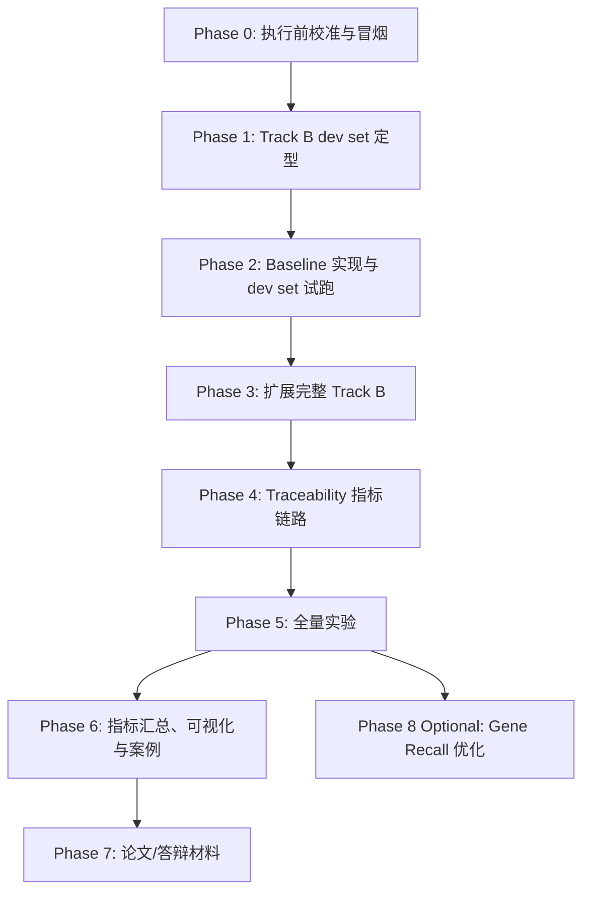

# GDgpt 毕设冲刺执行计划（修订版）

**日期**: 2026-05-13  
**项目**: GDgpt -- 精准肿瘤学 MTB 辅助系统  
**目标**: 优先达到毕设答辩可交付状态，同时保留论文叙事所需的外部 benchmark 可信度。

---

## TL;DR

这个版本的核心调整是：**不要把 Gene Recall 修复放在主线前面**，也**不要把 Track B 完全改成自制测试集**。当前最能支撑 GDgpt 答辩和论文故事的主线是：

1. 先做 3-5 题 Track B dev set，锁定 schema 和题目区分度。
2. 实现真实 baseline：GPT-4o direct / Single Agent + KG / RAG only，并立刻在 dev set 上试跑。
3. 如果 dev set 能拉开 Full / GPT-4o / Single Agent / RAG only 的差距，再扩展到 30 题 **混合 MTB 测试集**。
4. 每完成一个步骤，都同步写入导师汇报记录，保证任何时间都能拿出“做了什么、为什么、结果如何、下一步是什么”。
5. 修通 Traceability 指标链路，跑完主实验、案例分析和答辩结果页。

**Neo4j 已确认可连通，本计划不再安排 Neo4j 连接验证。**

---

## 导师汇报记录机制

**当前优先级**: 以导师汇报为主。任何技术步骤完成后，必须同步沉淀成可汇报内容，而不是等所有实验结束再回头补文档。

### 汇报主文档

建议新建或持续维护：

| 文档 | 用途 | 更新频率 |
| --- | --- | --- |
| `docs/导师汇报_执行记录_20260513.md` | 每一步的执行记录、结果、问题、下一步 | 每完成一个 Step 更新 |
| `docs/导师汇报文档.md` | 面向导师的阶段性正式汇报 | 每完成一个 Phase 后同步摘要 |
| `docs/DECISION_LOG.md` | 重大方向变化和不可逆决策 | 仅重大决策追加 |

如果不想新增太多文件，可以只新建 `docs/导师汇报_执行记录_20260513.md`，等阶段性内容稳定后再整理进 `docs/导师汇报文档.md`。

### 每步记录模板

每完成一个 Step，按下面格式追加：

```markdown
## YYYY-MM-DD Step X.Y: 标题

### 本步目标
- ...

### 执行动作
- 修改/新增了哪些文件：
- 运行了哪些命令或实验：

### 结果
- 成功产物：
- 关键数字：
- 截图/表格/输出位置：

### 发现的问题
- ...

### 对导师汇报的意义
- 这一步证明了什么？
- 是否影响原研究路线？

### 下一步
- ...
```

### 汇报粒度原则

1. **不要只写“完成了”**，要写“为什么这样做”和“结果说明什么”。
2. **结果不好也要记录**，尤其是 Gene Recall 低、baseline 拉不开、Traceability 为 NaN 这类问题。
3. 每个 Phase 结束后，必须形成一个 5-8 行的导师摘要。
4. 能放图表就放图表，不能放图表也要放 JSON/Markdown 结果路径。
5. 所有汇报继续中文为主，专业术语保留英文。

---

## 当前状态盘点

### 已完成

- 核心系统可运行：Triage -> KG Prefetch -> Consultation -> Safety Review。
- 11 种 KG 查询意图：8 单跳 + 3 Bridge。
- 7 角色专家协同 + KG coverage 感知。
- Track A 历史实验已有 Full / LLM only 结果。
- `run_batch_eval_template.py` 已支持 `full` / `llm_only`。
- `extract_from_tool_calls.py` 已能从 `tool_calls` 抽取 `predicted_*` 和 `bridge_found`。
- `compute_system_metrics.py` 已存在，但输入字段和抽取链路还需要对齐。

### 需要先校准

| 问题 | 当前风险 | 修订动作 |
| --- | --- | --- |
| Track A 题数混乱 | 文档说 38 题，但 `evaluation/evaluation_gold_final.jsonl` 当前是 30 行；38 题结果对应 `kg_opt_*` 文件 | Phase 0 先统一 Track A gold 文件和实验命名 |
| 冒烟测试会误跑全量 | `run_batch_eval_template.py` 没有 `--limit` 参数 | Phase 0 用单题 smoke gold 文件，或给脚本加 `--limit` |
| Track B 全自制可信度不足 | 容易被质疑题集为系统量身定做 | Phase 1 先做混合 dev set，Phase 3 扩成 30 题混合集 |
| Traceability 尚不能直接算 | `cited_edges` 目前不会由 extractor 自动生成 | Phase 4 补 `cited_edges` 抽取或人工标注 |
| Gene Recall 优化收益不确定 | `Recall@5` 不一定因 `k=8->20` 提升 | 降为可选 Phase 8 |

---

## 依赖关系总览



---

## Phase 0: 执行前校准与冒烟测试（0.5 天）

**目标**: 不再验证 Neo4j 连接，而是确认评测文件、脚本入口、单题端到端运行和指标链路不会卡住。

### Step 0.1: 统一 Track A gold 文件命名

先确认以下文件分别对应什么：

| 文件 | 当前用途 | 行数检查 |
| --- | --- | --- |
| `evaluation/evaluation_gold_final.jsonl` | 历史主 gold，当前看起来是 30 题 | 需要确认是否继续作为 quick/legacy |
| `evaluation/independent_testset/output/testset_kg_optimized_enriched.jsonl` | 38 题 KG 优化集，更符合 Track A 消融描述 | 建议作为 Track A 消融 gold |
| `evaluation/results/kg_opt_exp0_full.jsonl` | 38 题 Full 历史结果 | 对应 Track A |
| `evaluation/results/kg_opt_exp1_llm_only_v2.jsonl` | 38 题 LLM only 历史结果 | 对应 Track A |

**产出**: 在计划或实验报告中明确：

```text
Track A gold = evaluation/independent_testset/output/testset_kg_optimized_enriched.jsonl
Track A existing results = kg_opt_exp0_full / kg_opt_exp1_llm_only_v2
Legacy 30Q gold = evaluation/evaluation_gold_final.jsonl
```

### Step 0.2: 单题冒烟测试

`run_batch_eval_template.py` 目前没有 `--limit`，所以不要直接拿完整 gold 跑 smoke。二选一：

**方案 A（推荐）**: 给 `run_batch_eval_template.py` 增加 `--limit 1` 参数。

**方案 B（零代码改动）**: 临时生成单题 smoke gold。

PowerShell:

```powershell
Get-Content evaluation\independent_testset\output\testset_kg_optimized_enriched.jsonl -TotalCount 1 |
  Set-Content -Encoding UTF8 evaluation\results\smoke_gold_1.jsonl
python evaluation/run_batch_eval_template.py --gold evaluation/results/smoke_gold_1.jsonl --out evaluation/results/smoke_full.jsonl --max-rounds 2 --experiment full
```

**通过标准**:

- `evaluation/results/smoke_full.jsonl` 有 1 行。
- `answer_text` / `final_answer` 非空。
- `tool_calls` 非空。
- `kg_coverage_level` 有值。

**导师汇报记录**:

- 记录 Track A gold 文件最终采用哪个，为什么。
- 记录 smoke test 输入、输出路径和是否成功。
- 如果发现脚本缺少 `--limit`，记录为工程风险和修复建议。

### Step 0.3: 验证 extract + compute_metrics

```powershell
python evaluation/extract_from_tool_calls.py --pred evaluation/results/smoke_full.jsonl --out evaluation/results/smoke_full_extracted.jsonl
python evaluation/compute_metrics.py --gold evaluation/results/smoke_gold_1.jsonl --pred evaluation/results/smoke_full_extracted.jsonl --k 5
```

**通过标准**: 输出 JSON 指标，无报错。

**Phase 0 汇报摘要**:

- 写入 `docs/导师汇报_执行记录_20260513.md`。
- 摘要回答：当前评测链路是否可运行？Track A 文件是否已澄清？下一步为什么先做 Track B dev set？

---

## Phase 1: Track B dev set 定型（0.5-1 天）

**目标**: 先做 3-5 题 `evaluation/mtb_testset_dev_5.jsonl`，锁定 schema、题型和题目区分度。不要等完整 30 题写完后才发现 baseline 输出格式或题目设计不合适。

### Step 1.1: 创建 dev set

**文件**: `evaluation/mtb_testset_dev_5.jsonl`

建议 5 题覆盖：

| 题号 | 来源 | 题型 | 用途 |
| --- | --- | --- | --- |
| dev-001 | 自制 MTB / OncoKB | 机制解释 | 检查 gene-pathway-drug 基本链路 |
| dev-002 | 自制 MTB / CIViC | 耐药分析 | 检查临床上下文和变异解释 |
| dev-003 | PrimeKGQA cancer mini | KGQA | 检查外部 benchmark schema 兼容 |
| dev-004 | MTBBench text mini | longitudinal/text | 检查 MTB 场景文本化 |
| dev-005 | 低 KG 覆盖题 | evidence-insufficient | 检查 honest degradation |

### Step 1.2: 锁定 schema

dev set 直接使用完整 Track B schema：

```json
{
  "id": "mtb_dev_001",
  "source_track": "B3_self_mtb",
  "source_ref": "OncoKB/CIViC/public_case/manual",
  "task_type": "mechanism_explanation",
  "question": "A 55-year-old patient with EGFR L858R lung adenocarcinoma. Explain the gene-pathway-drug mechanism for MTB preparation.",
  "clinical_context": "55M, stage IIIB lung adenocarcinoma, EGFR L858R, no T790M",
  "disease": "lung adenocarcinoma",
  "gold_genes": ["EGFR"],
  "gold_actionable_genes": ["EGFR"],
  "gold_pathways": ["EGFR signaling", "RAF/MAP kinase cascade"],
  "gold_phenotypes": [],
  "gold_drugs": [{"name": "Osimertinib", "level": "OncoKB-1"}],
  "gold_bridge": true,
  "expected_kg_edges": [
    ["EGFR", "lung adenocarcinoma", "ASSOCIATED_WITH"]
  ],
  "gold_summary": "EGFR L858R activates downstream MAPK/PI3K signaling and supports EGFR TKI consideration.",
  "difficulty": "medium",
  "cancer_type": "lung",
  "annotation_status": "author_verified"
}
```

**通过标准**:

- 5 行 JSONL 全部可被 `compute_metrics.py` 和 `compute_system_metrics.py` 读取。
- 每题有 `source_track`、`gold_actionable_genes`、`expected_kg_edges`。
- 至少 1 题能体现 Bridge 价值，至少 1 题能体现 evidence-insufficient / honest degradation。

**导师汇报记录**:

- 记录 dev set 的 3-5 道题来源分布。
- 用表格说明每题想测试 GDgpt 的哪个能力：Traceability、Bridge、多 Agent、低覆盖诚实降级等。
- 说明为什么先做 dev set，而不是直接写 30 题。

**Phase 1 汇报摘要**:

- 产出一张“dev set 设计表”，可直接放入导师汇报。
- 如果某个外部 benchmark 暂时拿不到，记录降级策略，而不是默默改成全自制。

---

## Phase 2: Baseline 模式实现与 dev set 试跑（1.5 天）

**目标**: 实现答辩和论文最需要的三个真实对照组，并先在 `mtb_testset_dev_5.jsonl` 上试跑。Baseline 的作用不是服务旧测试集，而是检查新测试集是否能测出 GDgpt 的差异化价值。

### Step 2.1: `gpt4o_direct`

**文件**: `evaluation/run_batch_eval_template.py`

新增 `--experiment gpt4o_direct`：

- 不创建完整 workflow。
- 不调用 Neo4j / FAISS / multi-agent。
- 直接用 config 中的 `text_model` 或指定模型进行医学专家直答。
- 输出 schema 与现有 prediction 一致。
- `tool_calls=[]`。
- `kg_coverage_level="disabled"`。

**注意**: 如果实际配置不是 GPT-4o，而是 Qwen/OpenAI-compatible 模型，实验名可以保留 `gpt4o_direct`，但结果表必须记录真实 `text_model`。

### Step 2.2: `single_agent`

**文件**: `evaluation/run_batch_eval_template.py`、必要时改 `workflow.py` 或 `agents.py`

新增 `--experiment single_agent`：

- 仍使用 KG Prefetch 和工具。
- 强制 `selected_roles=["HypothesisIntegrator"]`。
- 保留 safety review。
- 用来证明“7 角色 MTB 席位协同”相对单综合 agent 的价值。

**实现建议**: 最干净的做法是在 workflow 或 runner 中加入 experiment override，而不是在 triage 后硬改一份局部变量。否则 consultation 节点可能仍读取 state 里的旧角色。

### Step 2.3: `rag_only`

**文件**: `agents.py`、`evaluation/run_batch_eval_template.py`

新增 `--experiment rag_only`：

- 保留 7 角色。
- 保留单跳 KG 查询。
- 禁用 3 个 Bridge intent：
  - `DiseaseGenePathwayBridge`
  - `GenePhenotypeBridge`
  - `DrugTargetDiseaseBridge`

**实现建议**:

- 给 `MDTAgents` 增加 `disabled_intents` 或 `disable_bridge` 配置。
- `plan_kg_queries()` 在输出计划后统一过滤禁用 intent。
- `_default_query_plan()` 也要同步过滤，否则 LLM planner 失败时仍会 fallback 到 Bridge。

### Step 2.4: dev set 四组试跑

用 5 题 dev set 跑：

| 实验 ID | 模式 | 目的 |
| --- | --- | --- |
| `dev_full` | `full` | 检查完整系统输出和 KG trace |
| `dev_gpt4o_direct` | `gpt4o_direct` | 检查直接 LLM 是否缺少 trace |
| `dev_single_agent` | `single_agent` | 检查多角色价值 |
| `dev_rag_only` | `rag_only` | 检查 Bridge 价值 |

**通过标准**:

- 四组都能跑出 5 行结果。
- Full 与 GPT-4o direct 在 Traceability 上应有明显差异。
- Full 与 RAG only 至少在 1-2 道 Bridge 题上有差异。
- 如果四组结果几乎一样，先改测试题，不要急着扩到 30 题。

**导师汇报记录**:

- 记录 3 个 baseline 的实现方式和公平性边界。
- 记录 dev set 四组试跑结果，即使只是定性观察也要写。
- 如果 baseline 拉不开差距，记录原因判断：题目问题、指标问题，还是系统优势确实不明显。

### Step 2.5: 更新实验配置

**文件**: `evaluation/experiment_config.yaml`

追加：

```yaml
  - id: exp4_no_bridge
    experiment: rag_only
    max_rounds: 6
    description: "RAG only / no Bridge intents"

  - id: exp5_single_agent
    experiment: single_agent
    max_rounds: 6
    description: "Single Agent + KG"

  - id: exp7_gpt4o_direct
    experiment: gpt4o_direct
    max_rounds: 1
    description: "Direct LLM baseline"
```

**Phase 2 汇报摘要**:

- 写清楚“baseline 不是旧测试集附属品，而是新测试集体检工具”。
- 给导师展示 dev set 初步对照结果，并说明是否可以扩展到 30 题。

---

## Phase 3: 扩展完整 Track B 混合 MTB 测试集（1.5-2 天）

**目标**: 基于 dev set 试跑反馈，扩展到 30 题 Track B 主实验测试集。不要完全自制；保留外部 benchmark 的可信度。

### 推荐组成

| 子集 | 数量 | 来源 | 目的 |
| --- | ---: | --- | --- |
| B1 PrimeKGQA cancer mini | 8-10 | PrimeKGQA 癌症相关 QA 子集 | 证明不是纯自造，且贴近 PrimeKG/KGQA |
| B2 MTBBench text/longitudinal mini | 5-10 | MTBBench 纵向文本或可文本化题目 | 贴近 MTB 场景 |
| B3 自制 MTB 补充 | 10-15 | OncoKB / CIViC 公开信息 + KG 覆盖确认 | 展示 Bridge、药物机制、耐药分析 |

若外部数据下载或许可处理来不及，最低可接受降级为：

```text
5 PrimeKGQA + 5 MTBBench + 20 自制 MTB
```

但不建议变成 30 题全自制。

### Schema

**文件**: `evaluation/mtb_testset_v1.jsonl`

每条记录建议包含：

```json
{
  "id": "mtb_001",
  "source_track": "B3_self_mtb",
  "source_ref": "OncoKB/CIViC/public_case/manual",
  "task_type": "mechanism_explanation",
  "question": "A 55-year-old patient with EGFR L858R lung adenocarcinoma. Explain the gene-pathway-drug mechanism for MTB preparation.",
  "clinical_context": "55M, stage IIIB lung adenocarcinoma, EGFR L858R, no T790M",
  "disease": "lung adenocarcinoma",
  "gold_genes": ["EGFR"],
  "gold_actionable_genes": ["EGFR"],
  "gold_pathways": ["EGFR signaling", "RAF/MAP kinase cascade"],
  "gold_phenotypes": [],
  "gold_drugs": [{"name": "Osimertinib", "level": "OncoKB-1"}],
  "gold_bridge": true,
  "expected_kg_edges": [
    ["EGFR", "lung adenocarcinoma", "ASSOCIATED_WITH"]
  ],
  "gold_summary": "EGFR L858R activates downstream MAPK/PI3K signaling and supports EGFR TKI consideration.",
  "difficulty": "medium",
  "cancer_type": "lung",
  "annotation_status": "author_verified"
}
```

**关键要求**:

- 同时保留 `gold_genes` 和 `gold_actionable_genes`，兼容 `compute_metrics.py` 和 `compute_system_metrics.py`。
- `expected_kg_edges` 用数组三元组，减少 dict/list 混用。
- 每题必须有 `source_track`，答辩时能解释来源。
- 自制题必须记录 `source_ref`，不要只写 `author_verified`。

### 题型分布

| 题型 | 数量 | 说明 |
| --- | ---: | --- |
| 机制解释 | 10 | gene -> pathway -> disease |
| 药物靶点 | 8 | drug -> target -> disease |
| 耐药/变异解释 | 6 | EGFR T790M、KRAS、BRCA/PARP 等 |
| 证据不足/低覆盖 | 3 | 测 honest degradation |
| 综合 MTB 病例 | 3 | 带 clinical_context，用于案例分析 |

**导师汇报记录**:

- 汇总 30 题来源比例：PrimeKGQA / MTBBench / 自制 MTB。
- 汇总 30 题题型比例：机制解释、药物靶点、耐药、低覆盖、综合病例。
- 记录为什么这个测试集比纯自制更可信。
- 标记哪些题适合后续做案例分析。

**Phase 3 汇报摘要**:

- 产出“Track B 测试集设计说明”小节。
- 说明测试集如何对应导师关心的 MTB 场景，而不是通用 biomedical QA。

---

## Phase 4: Traceability / Hallucination 指标链路修正（1 天）

**目标**: 让系统级指标能真实计算，而不是只生成 NaN。

### Step 4.1: 对齐 `compute_system_metrics.py` 字段

当前 `compute_system_metrics.py` 期待：

- `gold_actionable_genes`
- `expected_kg_edges`
- `cited_edges`
- `asserted_claims`

因此 Track B gold 必须补 `gold_actionable_genes` 和 `expected_kg_edges`。

### Step 4.2: 生成 `cited_edges`

**文件**: `evaluation/extract_from_tool_calls.py`

在抽取 `predicted_*` 的同时，从 `tool_calls.runs.records` 生成 `cited_edges`。

最低可行规则：

| intent | cited edge |
| --- | --- |
| `DiseaseToGene` | `[gene, disease, relation]` |
| `GeneToPathway` | `[gene, pathway, relation]` |
| `DiseaseToDrug` | `[drug, disease, relation]` |
| `DrugTargetDiseaseBridge` | `[drug, gene, "TARGETS"]` 与 `[gene, disease, "ASSOCIATED_WITH"]` |
| `DiseaseGenePathwayBridge` | `[gene, disease, "ASSOCIATED_WITH"]` 与 `[gene, pathway, "INVOLVED_IN"]` |

**注意**: 这不是完美 provenance，但足够支持答辩中的 Traceability 计算。

### Step 4.3: Hallucination 计算策略

不要假装全自动。

推荐二选一：

| 策略 | 成本 | 可信度 |
| --- | ---: | --- |
| 10 题人工抽样标注 `asserted_claims` | 中 | 高，适合答辩 |
| LLM judge 生成 `asserted_claims`，人工复核 5 题 | 低-中 | 可接受，但要诚实说明 |

如果来不及，主结果只报告：

- Traceability
- Honest Degradation Rate
- Loose Accuracy

Hallucination Rate 放入 “manual subset analysis”。

**导师汇报记录**:

- 记录 `compute_system_metrics.py` 最终使用了哪些字段。
- 记录 `cited_edges` 是如何从 `tool_calls` 抽取的。
- 明确写出 Hallucination Rate 的计算边界：全量自动、LLM judge、还是人工抽样。
- 如果某指标暂时不能算，必须写“暂不报告”，不要写空数字。

**Phase 4 汇报摘要**:

- 产出“系统级指标定义与可计算性说明”。
- 给导师解释 Traceability 为什么比单纯 F1 更适合本项目。

---

## Phase 5: 全量实验运行（3-4 天）

**目标**: 先跑 Track B 主实验，再补 Track A 消融。答辩主叙事以 Track B 为主。

### Step 5.1: Track B 主实验（30 题）

| 实验 ID | 模式 | max_rounds | 优先级 | 说明 |
| --- | --- | ---: | --- | --- |
| `mtb_exp0_full` | `full` | 6 | P0 | GDgpt 完整系统 |
| `mtb_exp7_gpt4o_direct` | `gpt4o_direct` | 1 | P0 | 真实直答 baseline |
| `mtb_exp5_single_agent` | `single_agent` | 6 | P0 | 单 agent + KG |
| `mtb_exp8_rag_only` | `rag_only` | 6 | P0 | 无 Bridge 的 RAG/KG baseline |

每跑完一组，立刻执行：

```powershell
python evaluation/extract_from_tool_calls.py --pred evaluation/results/mtb_exp0_full.jsonl --out evaluation/results/mtb_exp0_full_extracted.jsonl
python evaluation/compute_metrics.py --gold evaluation/mtb_testset_v1.jsonl --pred evaluation/results/mtb_exp0_full_extracted.jsonl --k 5
python evaluation/compute_system_metrics.py --predictions evaluation/results/mtb_exp0_full_extracted.jsonl --gold evaluation/mtb_testset_v1.jsonl --out evaluation/results/mtb_exp0_full_system_metrics.json
```

**通过标准**:

- 每个 JSONL 行数 = 30。
- `[ERROR]` 行数尽量为 0；如有，必须记录并重跑。
- `traceability` 不是 NaN。

**导师汇报记录**:

- 每跑完一组实验，立刻记录：输入 gold、输出文件、模型版本、max_rounds、错误数、耗时。
- 不等四组全跑完再写记录。
- 如果某组结果异常，要记录是否重跑、是否排除、是否保留为失败案例。

### Step 5.2: Track A 消融实验

| 实验 ID | 模式 | max_rounds | 优先级 |
| --- | --- | ---: | --- |
| `kg_opt_exp0_full` | `full` | 6 | 已有 |
| `kg_opt_exp1_llm_only` | `llm_only` | 6 | 已有 |
| `kg_opt_exp4_no_bridge` | `rag_only` | 6 | P1 |
| `kg_opt_exp5_single_agent` | `single_agent` | 6 | P1 |

Track A 的作用是补充结构化检索层面的消融，不要让它压过 Track B MTB 主实验。

**Phase 5 汇报摘要**:

- 产出“实验运行状态表”。
- 重点汇报 Track B 主实验；Track A 作为消融补充。
- 如果时间不够，优先保证 Track B 四组完整，而不是平均分散到所有实验。

---

## Phase 6: 指标汇总、可视化与案例分析（1-2 天）

**目标**: 生成能直接放进论文/答辩 PPT 的表格和图。

### 输出文件

| 文件 | 内容 |
| --- | --- |
| `evaluation/results/results_summary_track_b.json` | Track B 四组主实验 |
| `evaluation/results/results_summary_track_a.json` | Track A 消融 |
| `evaluation/results/results_summary_v2.json` | 总汇总 |
| `evaluation/results/retrieval_metrics.png` | Gene/Pathway/Bridge/Coverage |
| `evaluation/results/system_metrics.png` | Traceability / Honest Degradation / Loose Accuracy |

### 表格优先级

1. Track B system-level 指标表：最重要。
2. Track B retrieval/end-to-end 指标表：辅助。
3. Track A 消融表：证明 Bridge 和多 agent 有贡献。
4. 错误案例统计表：诚实展示局限。

---

### 案例分析

**目标**: 3 篇 Markdown，直接服务答辩和论文案例章节。

| 案例 | 选择标准 | 目的 |
| --- | --- | --- |
| 成功案例 | Full traceability 高、Bridge 命中、答案清晰 | 展示 GDgpt 价值 |
| 失败案例 | Gene Recall / Traceability 低 | 诚实解释 KG 覆盖、实体匹配或排序问题 |
| 典型 MTB 案例 | 有 clinical_context，涉及 gene-pathway-drug | 展示 7 角色 -> MTB 席位映射 |

每篇至少包含：

- 输入问题和 clinical context。
- KG prefetch / specialist tool calls 摘要。
- 系统最终回答。
- Gold 对比。
- 成功或失败原因。
- 对应论文叙事点。

**导师汇报记录**:

- 汇总最终指标表和图表路径。
- 每篇案例写 5-8 行导师可读摘要，不只保留详细 Markdown。
- 明确成功案例证明什么，失败案例暴露什么，典型 MTB 案例如何支撑场景定位。

**Phase 6 汇报摘要**:

- 形成导师汇报最核心的结果页材料：一张主结果表、一张图、三个案例摘要。

---

## Phase 7: 论文/答辩材料草稿（2-3 天）

**目标**: 先完成答辩可讲版本，再扩展论文。

### 答辩优先叙事

1. 原问题：MTB 会前准备需要快速整理 gene-disease-pathway-drug 机制证据。
2. 现有 GPT-4o 直答问题：答案流畅但证据不可追溯，容易混合事实和推测。
3. GDgpt 方法：Task KG + KG Prefetch + 7 角色 MTB 席位 + Safety Review。
4. 主结果：GDgpt 在 Traceability / Honest Degradation / Bridge evidence 上优于 baseline。
5. 局限：Gene Recall 低、KG 覆盖不均、药物证据仍依赖外部数据库。

### 论文草稿章节

1. Introduction
2. Related Work
3. System Design
4. Benchmark and Evaluation
5. Results
6. Case Studies
7. Limitations and Future Work
8. Conclusion

**导师汇报记录**:

- 把 Phase 0-6 的执行记录整理成正式汇报文档。
- 每个章节只保留导师最需要的信息：目的、方法、结果、问题、下一步。
- 明确哪些内容可用于答辩 PPT，哪些内容可用于论文草稿。

**Phase 7 汇报摘要**:

- 产出可直接发给导师的阶段汇报版本。
- 重点不是“所有实验都完美”，而是“路线清楚、证据充分、问题诚实、下一步明确”。

---

## Phase 8 Optional: Gene Recall 优化（0.5-1 天）

**仅在 Phase 1-6 完成后执行。**

### 可做改动

| 改动 | 预期收益 | 风险 |
| --- | --- | --- |
| `DiseaseToGene k=8 -> 20` | 增加候选池 | 对 Recall@5 不一定有效 |
| Bridge 中按 weight + gene_count 排序 | 可能改善关键 pathway/gene 排名 | 需要验证历史结果是否可比 |
| 在 extractor 中保留原始排序而非排序集合 | 让 Recall@5 更真实 | 需要改动抽取逻辑 |

### 不建议

- 不要为了提升分数重建 KG。
- 不要在主实验中偷偷改变 gold 或排序规则。
- 不要把 Gene Recall 讲成主卖点；它是已知弱点和后续改进方向。

**导师汇报记录**:

- 如果执行 Gene Recall 优化，必须单独标记为 “optional post-hoc improvement”。
- 主实验结果和优化后结果分开报告，避免被质疑调参污染主结论。

---

## 时间线总览

| 阶段 | 预计耗时 | 技术产出 | 汇报产出 |
| --- | ---: | --- | --- |
| Phase 0: 执行前校准与冒烟 | 0.5 天 | Track A 文件统一、单题 smoke 通过 | 评测链路状态记录 |
| Phase 1: Track B dev set 定型 | 0.5-1 天 | `mtb_testset_dev_5.jsonl` 3-5 题 | dev set 设计表 |
| Phase 2: Baseline 实现与 dev set 试跑 | 1.5 天 | 3 种新实验模式 + dev 四组结果 | baseline 公平性说明 + dev 初步结果 |
| Phase 3: 完整 Track B 混合测试集 | 1.5-2 天 | `evaluation/mtb_testset_v1.jsonl` 30 题 | Track B 测试集设计说明 |
| Phase 4: Traceability 指标链路 | 1 天 | `cited_edges` 可计算，system metrics 非 NaN | 系统级指标定义与边界说明 |
| Phase 5: 全量实验 | 3-4 天 | Track B 4 组 + Track A 2 组补充 | 实验运行状态表 |
| Phase 6: 指标、可视化与案例 | 1-2 天 | 汇总表 + PNG 图 + 3 篇案例 | 主结果页 + 三个案例摘要 |
| Phase 7: 论文/答辩材料 | 2-3 天 | 论文 v0.1 + 答辩结果页 | 可发导师的阶段汇报文档 |
| Phase 8 Optional: Gene Recall | 0.5-1 天 | 可选优化结果 | optional improvement 说明 |
| **总计** | **约 12 天** | 毕设答辩可交付 |

---

## 关键约定

1. `config.json` 含 API Key，永不提交 git。
2. Neo4j 已可连通，本计划不再重复验证连接，也不删除 Docker Volume `neo4j-data`。
3. 所有实验固定记录 `max_rounds`、生成模型、critic 模型、temperature。
4. 评测产物统一放 `evaluation/results/`。
5. 不要同时运行两个会写入同一 JSONL 的批量评测进程。
6. Track B 不建议全自制，至少保留外部 benchmark 小样本。
7. Traceability / Hallucination 计算必须诚实：没有 `cited_edges` 或 `asserted_claims` 时不能硬报数字。
8. Gene Recall 是可选优化，不作为当前主线阻塞项。
9. 当前以导师汇报为主，每完成一个 Step 都要更新 `docs/导师汇报_执行记录_20260513.md`。
10. 每完成一个 Phase，都要把 5-8 行摘要同步到 `docs/导师汇报文档.md` 或正式汇报草稿。
11. 文档和汇报继续中文为主，专业术语保留英文。
